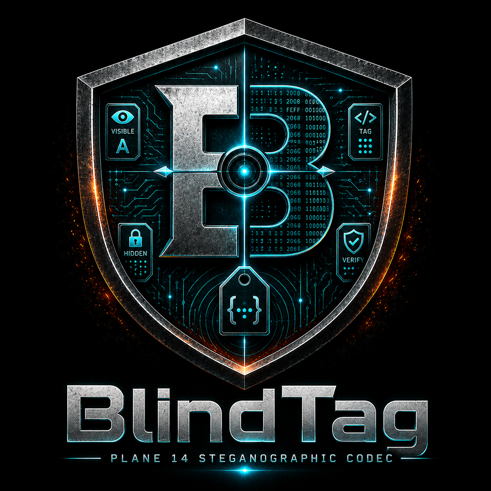

# ⬡ BlindTag

<p align="center">
  
</p>

> Unicode Plane 14 Steganographic Obfuscation Toolkit

A [Polymath](https://polymath-global.com) open-source project.

BlindTag embeds invisible payloads inside ordinary Unicode text using characters from the **Tags block** (U+E0000–U+E007F) in Unicode Plane 14. The result is visually indistinguishable from the original string and survives NFC / NFD / NFKC / NFKD normalization intact.

---

## Architecture

```
blindtag/
├── blindtag/
│   ├── __init__.py        Public API surface
│   ├── core.py            Codec engine — encode / decode / strip_plane14
│   ├── api.py             FastAPI local transport layer
│   ├── widget.py          Desktop observer widget (customtkinter)
│   └── exceptions.py      Domain exception hierarchy
├── tests/
│   ├── test_core.py       Core engine unit tests (pytest)
│   └── test_api.py        API endpoint integration tests
├── run_api.py             API server launcher
├── run_widget.py          Desktop widget launcher
├── pyproject.toml         Package metadata & entry points
└── requirements.txt       Runtime dependencies
```

---

## Mathematical Basis

The Tags block occupies 128 codepoints in Plane 14, mirroring the ASCII table shifted by a fixed offset of **0xE0000** (917 504 decimal):

```
Encode:  ord(ascii_char)    + 0xE0000  →  Plane 14 tag codepoint
Decode:  plane14_codepoint  - 0xE0000  →  ord(ascii_char)
```

| ASCII character | Codepoint | Plane 14 tag     |
|-----------------|-----------|------------------|
| `A`             | U+0041    | U+E0041          |
| `z`             | U+007A    | U+E007A          |
| `!`             | U+0021    | U+E0021          |
| `~` (max)       | U+007E    | U+E007E          |

**Payload framing:** Every payload is terminated by **U+E007F (TAG CANCEL)** — the only Plane 14 character outside the printable ASCII mirror. The decoder uses it as an unambiguous end-of-stream sentinel.

```
[ anchor text ][ U+E0020…U+E007E payload chars ][ U+E007F TAG_CANCEL ]
```

---

## Installation

### From source (recommended)

```bash
git clone https://github.com/joediggidyyy/blindtag.git
cd blindtag

# Runtime only
pip install -e .

# Runtime + dev/testing tools
pip install -e ".[dev]"
```

### Explicit requirements

```bash
pip install -r requirements.txt       # runtime
pip install -e ".[dev]"               # + pytest, httpx, coverage
```

**Python requirement:** 3.11 or later.

### Linux clipboard support

`pyperclip` needs `xclip` or `xsel` on Linux:

```bash
sudo apt install xclip      # Debian / Ubuntu
sudo dnf install xclip      # Fedora / RHEL
sudo pacman -S xclip        # Arch
```

---

## Quick Start

### Python API

```python
from blindtag import encode, decode, strip_plane14

# Embed a hidden payload
tagged = encode(
    anchor="Meeting notes from Monday sync.",
    hidden_message="CONFIDENTIAL:REF-INV-7821"
)

# Visually identical to the anchor
print(tagged)
# → "Meeting notes from Monday sync."  (invisible tag chars follow)

# Extract the payload
secret = decode(tagged)
print(secret)
# → "CONFIDENTIAL:REF-INV-7821"

# Strip all Plane 14 chars — recover clean anchor
clean = strip_plane14(tagged)
print(clean)
# → "Meeting notes from Monday sync."
```

### Error handling

```python
from blindtag import encode
from blindtag.exceptions import InvalidPayloadError

try:
    encode("cover", "café")          # é is non-ASCII → raises
except InvalidPayloadError as exc:
    print(exc)
    # Payload character at index 3 — U+00E9 'é' — is outside
    # the allowed printable ASCII range [U+0020..U+007E].
```

---

## Module A — Core Engine (`blindtag/core.py`)

| Symbol | Type | Description |
|---|---|---|
| `PLANE14_OFFSET` | `int` | `0xE0000` — bitwise shift constant |
| `TAG_CANCEL` | `str` | `"\U000E007F"` — payload terminator |
| `ASCII_MIN` | `int` | `0x20` — lower payload boundary |
| `ASCII_MAX` | `int` | `0x7E` — upper payload boundary |
| `encode(anchor, hidden_message)` | `str` | Embed payload into cover text |
| `decode(raw_text)` | `str \| None` | Extract payload; `None` if absent |
| `strip_plane14(text)` | `str` | Remove all tag characters |

### Payload character set

Only **printable ASCII** is accepted as payload input (95 characters):

```
U+0020 SPACE  through  U+007E TILDE
```

Control characters (`\n`, `\t`, `\x00`, …), DEL (`\x7F`), and any non-ASCII Unicode will raise `InvalidPayloadError`.

### Normalization safety

The Unicode standard explicitly excludes the Tags block from NFC, NFD, NFKC, and NFKD composition / decomposition (Unicode 15.0 §23.9). A tagged string that passes through `unicodedata.normalize()` retains its payload:

```python
import unicodedata
from blindtag import encode, decode

tagged = encode("résumé", "normalization_safe")
assert decode(unicodedata.normalize("NFC",  tagged)) == "normalization_safe"
assert decode(unicodedata.normalize("NFD",  tagged)) == "normalization_safe"
assert decode(unicodedata.normalize("NFKC", tagged)) == "normalization_safe"
assert decode(unicodedata.normalize("NFKD", tagged)) == "normalization_safe"
```

---

## Module B — API Server (`blindtag/api.py`)

```bash
python run_api.py                   # http://127.0.0.1:8000
python run_api.py --port 9000       # custom port
python run_api.py --reload          # hot-reload (dev mode)
python run_api.py --log-level debug
```

Interactive docs: **http://127.0.0.1:8000/docs**

### `POST /v1/encode`

**Request**

```json
{
  "anchor": "Meeting notes from Monday sync.",
  "hidden_message": "CONFIDENTIAL:REF-7821"
}
```

**Response**

```json
{
  "result": "Meeting notes from Monday sync.<invisible>",
  "anchor_length": 31,
  "payload_length": 21,
  "total_length": 53
}
```

### `POST /v1/decode`

**Request**

```json
{
  "raw_text": "Meeting notes from Monday sync.<invisible>"
}
```

**Response (payload found)**

```json
{
  "found": true,
  "message": "CONFIDENTIAL:REF-7821",
  "detail": "Payload successfully extracted (21 characters)."
}
```

**Response (no payload)**

```json
{
  "found": false,
  "message": null,
  "detail": "No Plane 14 tag payload detected in the provided text."
}
```

### `GET /health`

```json
{ "status": "ok", "service": "BlindTag API", "version": "1.0.0" }
```

### Payload size policy

| Field | Maximum |
|---|---|
| `anchor` | 10 000 chars |
| `hidden_message` | 1 000 chars |
| `raw_text` | 50 000 chars |

Requests exceeding these limits receive **HTTP 422** before any codec logic runs.

---

## Module C — Desktop Widget (`blindtag/widget.py`)

```bash
python run_widget.py
```

### Hotkeys

| Shortcut | Action |
|---|---|
| `Ctrl+E` | Switch to Encode panel |
| `Ctrl+D` | Switch to Decode panel |
| `Ctrl+W` | Toggle Clipboard Watcher |
| `Ctrl+Return` | Execute active panel primary action |
| `Escape` | Close widget |

### Clipboard Watcher

When enabled, a background daemon thread polls the system clipboard every **800 ms**. If new clipboard content contains a Plane 14 payload, the widget:

1. Switches to the Decode panel automatically
2. Populates raw input and extracted payload fields
3. Displays a floating notification banner (auto-dismisses after 4.5 s)
4. Brings the window to the foreground

No data leaves the local machine. The watcher thread is a Python `daemon` thread — it exits cleanly when the widget closes.

---

## Running Tests

> Tests are orchestrated via **[Calamum](https://github.com/joediggidyyy/calamum)** — the Polymath test runner.
>
> 

```bash
# All tests
pytest

# Core engine only
pytest tests/test_core.py -v

# API integration only
pytest tests/test_api.py -v

# With coverage report
pytest --cov=blindtag --cov-report=term-missing
```

### Test coverage map

| Class | Requirement |
|---|---|
| `TestRoundTrip` | Encode→decode fidelity across payload types |
| `TestAnchorModification` | Payload integrity through whitespace/newline mutations |
| `TestAnchorEdgeCases` | Multi-byte emoji, CJK, RTL, alphanumeric anchors |
| `TestValidationBoundaries` | `InvalidPayloadError` for every out-of-range char |
| `TestDecodeNoPayload` | `None` return on clean strings |
| `TestCrashImmunity` | No exceptions on arbitrary / corrupted Plane 14 input |
| `TestNormalizationResistance` | NFC / NFD / NFKC / NFKD payload preservation |
| `TestTagCancelSemantics` | Hard stop at U+E007F; second payload ignored |
| `TestStripPlane14` | Sanitization utility correctness |
| `TestLongPayloads` | 128-char and 512-char payload integrity |
| `TestEncodeEndpoint` | API schema, validation, error codes |
| `TestDecodeEndpoint` | API round-trip, miss feedback, size limits |

---

## Security Notes

- **Localhost only.** The API server binds to `127.0.0.1` by default. Never expose it on `0.0.0.0` in untrusted network environments.
- **Input sanitization.** The Pydantic validation layer rejects oversized and malformed payloads at the HTTP boundary before any codec code executes.
- **No persistence.** The widget and API hold no state between requests. All data lives in process memory only.
- **Platform clipboard.** The clipboard watcher reads only from the local system clipboard using `pyperclip`. It does not transmit data over any network.

---

## License

MIT — see `LICENSE` for details.

---

<p align="center">
  <a href="https://polymath-global.com">
    
  </a>
  <br>
  <em>BlindTag is developed and maintained by <a href="https://polymath-global.com">Polymath Global</a>.</em>
</p>
